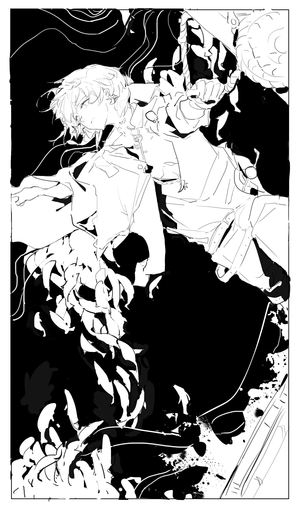

伊比利亚的普通人们压抑着欲望{.textkai}

被告诫贫瘠即可换来安逸{.textkai}

可一只海嗣、一次敌袭{.textkai}

就如此轻易地打破这表象{.textkai}

<!-- more -->

这把剑已经陪着棘刺很久了。

最开始，这只是一把普通的剑，那时他是伊西多，是炼金术师奥卢斯最得意的弟子。那个人轻轻引着他的手，在半空划出一道优美的弧线——他说，这是至高之术。

剑刃破空的角度、剑尖划出的轨迹，虚无的技巧被解构为精确的计算和数据，永远可靠，永远有迹可循。

在他剑术初有小成后，那个人又说，他可以有一把自己的剑。

伊西多很兴奋。他没有去武器铺，没有去寻访传说中的名剑。并不擅长武器设计的他把自己在书堆里埋了一周，材料密度与刚度间的取舍，最契合物理学的流线……剑的图纸，是伊西多亲手作出，又亲眼见证它自淬火炉中诞生的。

---

可计算与论证无法预测动荡的世事。在周围气氛愈加不安，在同门一个接一个消失，在他……给出那枚第三面的金币后，他成为了众多远离故土的阿戈尔中的一个。

伊西多并不眷恋那片灰白的土地，也并不赞同老师的荒诞决定。他怀疑过奥卢斯的知识是否混杂了异族的低语，剑术是否又模仿了蠕动的腕足……可知识是侵染终生的毒药，炼金与剑术已是如此根深蒂固地成为了他的一部分，无法剔除，无法摆脱。

伊西多改装了自己的剑。剑柄末端加装的导管连接着自制的神经毒素，能够高效而精准地让敌人失去行动能力。使用至高之术的阿戈尔人本身就时常受到来自正统的质疑，遑论这样的“创意”。许多次，那些追捕炼金术师遗党的人都在倒下时叫嚷过“阴险”“手段不正”一类的话。

不过伊西多并不在意，毕竟纠结所谓“正统”的人都横在地上了。更何况，在这漫长的离乡路上，他还需要这剑术去保护自己，以及更多流离的阿戈尔人。

---

他来到了罗德岛，获得了一个新的名字——棘刺。在这里，他是研究员，是博士轮班的助理之一，是一些人的朋友……不再是深海教会教众的弟子，不再是被驱逐的无乡可归之人。

直到那个普通的假期。

他清晰地知道汐斯塔没有真正的海，可体内异种的血却违背理性，在沉寂多年后再次搏动。仿佛有盐腥的风掠过侧脸，柔和如母亲对孩子的抚摸，亲切到令人作呕。

棘刺，或者说伊西多，握紧了手中的剑，正如海逐渐攥紧他的咽喉。

谁也不能剥夺伊比利亚人呼吸的权利，即使是故乡本身。

“我想杀了他。”

---

与风浪相搏的剑术。

听起来相当诗意的描述。或者说，大部分伊比利亚人在成年之后都不会再相信这样的故事。

所以，当棘刺一脸正经地对极境宣布自己要去寻找它时，极境拍着他的肩膀笑了足足五分钟以表明这是一个相当不错的冷笑话——直到他发现棘刺依然注视着他。

好像不是玩笑。

极境默默地收回手：“我一直有种感觉，你们阿戈尔人好像心里总是揣着事，总想去改变一些什么。”想了想，他又轻轻搭上棘刺的肩：“不管怎样，我相信你。”

---

棘刺想过这一路不会轻松，想过无功而返。

没想过那把剑断得如此轻易。

他承认，遇到老师的旧物，的确让他的理智显著偏离了阈值，以至于他在执裁官面前露出了如此明显的破绽……

或许除此以外，故土本身也足够令人愤怒。

被驱逐的阿戈尔人，饥馑困顿的居民，以及躲在他身后的以偷盗为生的孩子——或许与他遇见奥卢斯那年一般大……这片土地在他阔别已久的重逢中，依旧压抑而执拗，日复一日的苍白暗淡永无明日。

仿佛所谓的黄金时代只是一场遥遥无望的旧梦。

---

那位老人对他说，“剑是用来砍人的，不是用来砍水的。”

棘刺想，他曾在另一个地方听过类似的话，在博士桌上一位炎国导演的剧本里。剧本很烂，不过有一句炎国俚语他记住了：“抽刀断水水更流。”

或许也是因为这个，极境拉他去客串那部电影里绕着一本书转圈打架的无名剑客之一时，他没有拒绝。不过他很快就后悔了——很难想象一千年前会有人用装有毒剂的刀、通讯员的发信器和电锯当武器。但那位导演看起来倒是颇为满意，说什么“后泰拉科技风与传统武侠的完美结合”。

顺利的话，或许能赶在那部片子全舰队公映之前回去。只是这把“科技风”的剑……大概需要花很长时间才能修好了。

---

伊西多碰到了一群奇怪的人。那群人自出生起从未见过海，却自称“海盗”。

从逻辑学上，这样的自我定义显然并不成立。可面对那些人眼里的热望，他却难得地没有纠正这些无理取闹地绑架了他的人。

然而，没有纠正这些人对海的错误向往的结果是，事情的发展大约确实是有些失控了。那个被他救下却又很快要死去的人对他说，他是“天生的海盗”。

理由是他“不喜欢安逸，常与危险动荡为伍”。

说真的，谁会不喜欢安逸呢？不喜欢食堂中午十二点准时出炉的薯条，不喜欢实验室数值稳定的温湿度计，还是不喜欢总能一起在舰桥上看星星的朋友？

可很多年前，当他沉溺于安逸的庇护所时，同门挣扎中抽出的腕足如同咒语一般刻在了这个幸存者今后的路途中，不断地呢喃着：这片大地没有真正的安全屋。

伊比利亚的普通人们压抑着欲望，被告诫贫瘠即可换来安逸，可一只海嗣、一次敌袭，就如此轻易地打破这表象。

他是在这自欺欺人的安逸中，选择了动荡。

 {.image-right-float style="max-width: 40%;"}

---

这艘船的船长胡安娜把罗盘交给了他，还有前预备炼金术师的制服。

平心而论，胡安娜大概不怎么了解炼金术，毕竟船上曾经那名炼金术师走得太早。奥卢斯炼金术的第一课：炼金术师本身也是炼金反应能量震荡中的一环。

尽管身量相近，那些看似繁琐的装饰于炼金术师而言，正如剑于一名剑客，合不合适只有自己知道。伊西多花了一些时间去调整它们，正如他曾经将那把剑数次打磨修改成最适合自己的样式……

说起剑，伊西多也很难相信，自己居然如此迅速地适应了新的刺剑——且不说那位年轻的主人大约比他稍矮一些，从劈砍到突刺的转变本身也需要大多数剑士漫长的调整时间。

不过，适用于任何情况的精确计算，或许就是至高之术吧。

---

胡安娜问他，“我们的人生到底是赌博，还是实验？”

这倒是很新奇的体验，毕竟在更多时候，他都是被评价“实验像赌博”的那一个。当大多数人选择再做几次可行性验证的时候，研究员棘刺大概率已经获得了成品或者一次爆炸。

但他一直都知道，这是不一样的。

实验就是实验，路径的可行性是其注定属性。只不过在确定这一属性时，棘刺往往更加激进，毕竟代价不过是烧焦的发尾和衣角，而结果是他可以最高效地获得答案。

可赌博是概率的游戏。这一次，代价是全船赖以生存的物资，是一位囿于盐漠的船长夙夜所求的唯一机会，在成功率不是百分之百时，这就是一场赌博，而他没有资格替大家下注。

而若退路在燃烧，当赌注不过是自己的性命，而赌桌的另一端是挚友的安危是许多人的梦想……他选择伸出手。

赌徒会在某一刻输光本金。

而实验者会在第一千次失败后第一千零一次重新出发。

---

这里没有卷心菜和薯条，没有设备齐全的实验室，连制服和刺剑都不称手。

可是伊西多选择留下。

极境说得对，他总想给这片苍白的土地带来些什么。久违的纪念日烟火，看清这片海的机会……也许这些都不是最合适的方法，但伊西多想，实验是他很擅长的事。

他举起那把并不那么称手的刺剑。

海面尽头初起的朝阳穿透雾气沉沉的海面，掠过环绕船体的心相原质，凝于剑尖灼目的一点。

伊比利亚的未来究竟在哪里呢？研究员棘刺、船长伊西多想。

至少，它不会在沉寂的海，不会在灰白的城镇，不会在重复的祈祷与忏悔。

或许会在扬起的风帆，在破旧的船，在渐起的歌与呼号。

在永远向前的剑尖。<eod />

（责任编辑：黒子；网页排版：Baka632；绘图：忒提丝的蝴蝶）

<FakeAds />