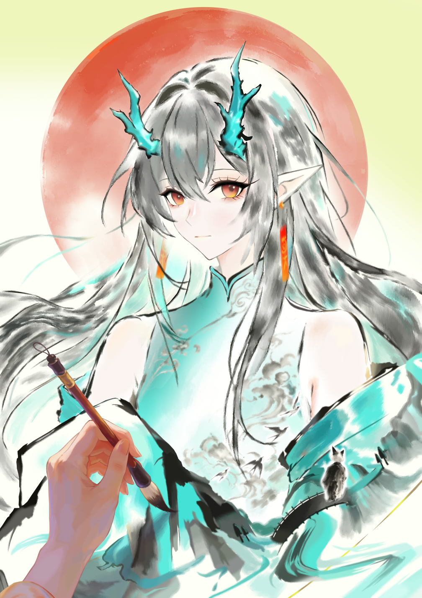

## （一）痴人语

我的奶奶虽已年过古稀，却仍旧一身子的孩童习气，平日里喜欢捉弄人不说，还总爱在一些小事上斤斤计较，就好像一个渴望得到注视的顽童似的。

就拿昨天举例，佣人只不过是忘换了她画室的插花，她就因此大发雷霆，语气严肃地数落了所有人一番不算，还砸断了一支价格不菲的白牙毛笔。还有一次印象颇深的经历是在去年冬天，她冷不丁地传信喊我归家，信里又是“再慢一点我这个老婆子就要驾鹤西去啦。” 又是“我恐怕熬不过这个冬天啦。”之类的恐怖话语。我当然一时间急得不知所措，抛下所有工作就赶回了老家。当我着急忙慌冲进画室，却见她正有说有笑地抱着一名看起来八九岁的女孩吃点心，一点也不像大限将至的样子。见我回来，她笑容满面地喊我坐下，对自己欺骗我的行为没有任何羞愧之意地同我唠起家常，仿佛什么都没发生过一般。作为她的孙女，我是晚辈里最受她照顾与疼爱的，自然没法怪罪她什么，只能用“越老越像个孩子”来宽慰自己放轻松些，一面替她剥起橘子，一面听她唠叨些有的没的。

剖除她偶尔发作的恶趣味玩笑，我的奶奶也绝非是一个正经人。她曾在佣人的被窝里藏蚂蚱，偷吃自己发给孙辈们的糖果，还会打扮成维多利亚女王的模样发表演讲。大家都说她精神有问题，只有从小就待在她身边的我知道这是独属于她的幽默。

我的父亲早年死于一场山洪，母亲则在不久后改嫁。那时的我才刚刚出生，母亲认为我的存在很大程度上会影响她未来的幸福，就将我寄养在了父亲的本家，也就是奶奶这。说是寄养，从后来母亲一次都没有来看望过我的事实来看，其实更像是抛弃。那时的我年纪尚小，就连父亲与母亲的概念都还未形成，因此对父亲的离世与母亲的抛弃并不感到悲伤，只不过会在长大后回想起来觉着有些遗憾罢了。

我被送往老宅时爷爷刚因心脏病发过世，我的出现很大程度上缓解了奶奶的痛苦与孤独。她将所有关爱倾注于我一人，同时也尽其所能地教育着我，不说把我教成了人中龙凤，她的存在至少令如今的我不会为父母的缺失而感到自卑。虽然她平日里总是摆出一副不着调的姿态，我却打心底里尊重这位将我拉扯大的奶奶。

话虽怎么说，当我在成年后才在兄弟姐妹们的口中得知奶奶就是被誉为“大炎当世最杰出的山水画师”的黄粱子时，我还是不免吃了一惊。

说起黄粱子，年幼的大炎人也许未曾听闻，可你若去问他们的父母，应该没有一位是对这名字感到陌生的。黄粱子，出身名叫“莫家”的绘画世家，后被钦点为宫廷画师，善绘山水图卷，尤以其笔法诡谲精细，意境空灵深邃被世人所推崇。一时间风头无两，在当时的大炎境内更是无人不知无人不晓，后不知为何年纪轻轻就告老还乡，淡出了大众视野。不过其少数于民间流窜的画作仍旧千金难求，在业界与俗世均饱负盛名。其中最绝妙，也是最昂贵的非《秋霖图》莫属。传说黄粱子这辈子画过无数幅《秋霖图》，却无论如何都自感落俗，往往是画了又撕，撕了又画，可即便是这般，那黄粱子眼中的“残次品”到了常人手中，也绝对算得上一件传世珍品。

仔细想来，奶奶的画室里也曾挂过一幅《秋霖图》，我也曾问起过这幅画的来历，她只道是随意收的仿品，其余一概不知。我却觉着那幅画不像是仿品，其构图，细节均与我所见过的真迹别无二样，说是仿品也怕只有黄粱子本人才能仿得如此精妙吧。那之后不久我再去看那幅画就已经被奶奶收起来了，我不好意思索要，这事也就不了了之。

这么一说奶奶就是黄粱子的证据似乎也并非无迹可寻。自我记事起奶奶就是一个酷爱摆弄画笔的人，家中有一间极大的画室，要比平日里家族聚餐的会客室还要大上一倍，奶奶日常的生活起居基本也都是待在那里。里边存放着诸多名家的绘作，奶奶说这都是太太爷爷留下的。我也是再之后才知道，原来我们所居住的那栋老宅本名就叫“莫家大院”，是奶奶年轻时从她的爷爷那继承下来的。而奶奶之所以不姓莫，也单纯只是因为她后来嫁到爷爷家改了姓氏。

奶奶虽自幼带着我画画（这很大程度上培养了我对于绘画的兴趣与审美能力），却不像教我读书那般严厉，往往带有浓厚的玩乐意味，也从不强求我去学。我没见过她画山水画，相反，她总是会画一些时下流行的风俗画来逗我开心，虽然画得惟妙惟肖，但年幼的我只是徒然地觉着画得像罢了。也许正是如此，我才会想当然地将奶奶的绘画当作不入流的兴趣爱好吧。

她有时会将自己关进画室，一关就是一周起步；有时则会一个人出门，从不告诉任何人她去哪里。我生来的笨拙不允许我多想什么，一直将这看作习以为常，从未推敲过其中的缘由。

某个细雨连绵的秋夜，我因恋爱问题辗转反侧，见奶奶的画室灯还亮着，索性就跑去瞧她画画，以此来分散注意力。自我得知奶奶就是黄粱子这一尽人皆知的秘密后，她每次作画也就不在我眼前藏着掖着了。

我趴在书桌上，望住摇曳的烛火，开始漫不经心地用手指在桌面上敲打出雨的节拍。奶奶则是不动声色地挥舞画笔，时而皱眉，时而咋舌；时而摸摸我的头，时而把玩起自己的头发。我问她在画什么，她答还是在作那幅《秋霖图》。

我觉着无趣，就开口问道。

“为什么奶奶从不教我画画呢？”

她顿了顿，将手中画笔搁在砚台，嘴里含笑着朝我反问道。

“怎么？墨儿想学？”

墨儿是她为我取的乳名，从出生起就一直叫到现在。

“倒也不是……只不过奶奶不是什么书法世家的传人么？想着技艺可能也要有人传承下去什么的，小说里都这么写。”

她笑着骂我长这么大还是傻里傻气的，我却不知自己傻在哪里，只好乖乖洗耳恭听。

“既然不想，那又有什么学的必要呢？强迫自己去做不想做的事，不是在为自己徒增烦恼吗？对人对己都是这一个道理啊。”

“可是这样一来奶奶乃至整个家族积累的技法不就都付诸东流了么？”

“技法？傻孩子，哪有什么技法可言。绘画，只不过是用墨与笔将眼前所见，心中所想，在这纸上尽数勾勒出来罢了。需要日复一日临摹精练的东西那叫基本功，它只能决定你能否能将东西给切实画下，任谁来努力，都终有穷尽的一天。

若想绘出完美的作品，最重要的是骨，是魂，是肉里头装的心。这是庸人再努力也无法追赶，所谓自然的鸿沟，身为画家的天分。

说到底，一个人究竟能画出怎样的作品，是从出生起就早已注定的……”

奶奶的眼神突然落寞起来，伸手笼住了那微弱的烛火。向日葵色的光从她指缝间迸发，干枯的手掌显现出有气无力的红。她笑了，痴痴的，好像扑火的蛾；几分不甘，几分愁怨，几分自嘲，几分迷惘，糅杂在一起，化作徒然一阵叹息。

我冥冥之中觉着奶奶在遗憾些什么，是未能画出满意的作品么？又或是对自己没法再更上层楼的无奈吗？我安慰式地抱住她，却不知该作何言语，直到真正触碰到她衰老的本质，我才意识到我的奶奶留存于世的时日恐怕没那么多了。

之后的日子我一直试图追寻这个问题答案，却如同追逐彗星的流火一般，徒劳且无趣地浪费了自己大把的时间与精力。一直到奶奶死后我才幡然醒悟，不过这都是后话了。

自那夜以后，奶奶就一直把自己关在画室里，除了每日送三餐的佣人能进去，其余人等均不被允许踏入画室。

晚秋的霖雨在记忆里被拉得悠长，也在某种程度上麻痹了我的精神。秋日就是用来休憩的，我如此想，凝望着从屋檐滑下的雨珠，在坠落中连成一线。

滴落地面的声音，仿佛享乐主义的恶魔在与我谈笑。

一日又一日的秋雨洗涤，院里的老海棠显露出衰败的迹象，奶奶却仍旧没有一点动静。雨停那天，天空异常的晴朗，举目望去全是蔚蓝的琉璃，叫人说不出的畅快。奶奶也是好不容易抓住了秋的尾巴，在入冬前作完了那幅《秋霖图》。

当我第一眼见到这幅画时，心里莫名咯噔了一下。也许是我的错觉，我总觉着那幅《秋霖图》要比以往任何一版还要厚重，还要精妙，短短十八尺的画卷就将一幕雨落树枯，叠嶂孤寂，寺庐破败的山水风景刻印进我的脑海，黑与白交融的艺术如此清晰，又是那么朦胧，恰似雾一般，将人拉入那深不可测的领域。

一种悲伤又空虚的情绪从眼球入侵我的大脑。两者相互交织，上升，最终构造成一个完美的圆。究竟是过于空虚溢出了悲伤，还是过于悲伤而徒然觉着空虚了呢？

我不清楚，也再没见过那幅画。

奶奶在完成它后就给我一人看过，说是主动给我看并不贴切，其实是在命我卷好装进画筒时偷偷看的。我选用了一个表面雕刻着龙凤纹样的黑檀木筒，晚些时候她就带着它离开了家。没人知道她去哪里，更没人知道她何时归来，就连与她最亲近的我她也绝不松口，执意要一个人去。我想她是要与谁赴约，不过具体是什么人，也许只有她自己清楚。

当晚我又梦见了那幅画。我梦见自己被一股强风吸入画中，等回过神，便已置身古道之上。我接着沿山路攀登，一路所见的风景算不得怡人，看多了反而叫眼睛觉着有些乏累。在这久下不停的雨里，暗色占据了大部分画面——天空是灰色的，枯枝则是棕色的，早已脱漆的古寺显现出趋近于血污的红褐色。一切都是那么的令人窒息。

我终于读懂了这幅画的真意，却迟迟不敢承认，自己原来从未没走进过奶奶的内心。

压抑之景里所蕴藏着的是七十年来无声的呻吟，就像是被铁链给锁住了一般，痛苦的回忆如怨灵般久久未能散去。一个不可能的想法突然在我脑袋里爆开，如一头怪兽般推翻时间所铸就的记忆高楼。

就在这时，一抹扎眼的丹青打乱了我的思绪。那是个女人。

她就站在那，站在晚秋的雨里，站在奶奶的画里，若有所思地望着什么。一袭惹眼的青衣令她与周围的色彩格格不入，如火焰般，将暗无天日的一切烧得明亮。

她是一个符号，一个代表希望或是梦魇的符号。但无可置疑的是，在这灰暗的世界里，她是奶奶眼中唯一的色彩。

我这才意识到，绘画之于奶奶的痛苦，要远大于快乐……

奶奶是在次日的傍晚出现在家门口的。

佣人发现她时她全身正淌着虚汗，嘴里一直念叨着些听不懂的话语，已经有些神志不清了。

没人知道消失的这一天半里奶奶究竟经历了什么，一夜未退的高烧始终牵动着全家人的心，以至于根本没人去考虑事情的缘由。较为年长叔父主动承担起管理秩序的裁决权，他先是叫表哥带人去请隔壁村的天师，又吩咐下众人各自的工作，俨然一副将军做派。

我始终守在奶奶床前，替她擦汗，轻声喊她的名字，一遍又一遍地告诉她我明白了。

可回应我的只有痛苦的呻吟，那幅失踪的画又一次鲜明地重现在我眼前，就好像奶奶这辈子的缩影一般。

到了后半夜，已经前前后后请来了五位天师，均对奶奶的病情表示束手无策。我情绪崩溃地大骂他们是废物，在任性地发泄完一通后，我跪在奶奶床前哭了起来。

叔父摇摇头，请离了诸位天师，开始叫一旁的佣人尽快通知在外的子嗣归家，并着手安排起奶奶的后事。

我仍旧像个孩子似的抱有不切实际的幻想，直到眼泪哭干，手心之物逐渐丧失温度。我才在周围“临终！临终！”的哭喊声里回过神来，慢半拍地接受了奶奶去世的事实。

奶奶去世后的很长时间里我都活得浑浑噩噩，整天把自己锁在她的画室里，不同任何人交谈。

由于长时间的翘班，我被工作的岗位所辞退。奶奶死得太过突然，生前并未留下任何遗嘱，遗产分配全权交由叔父负责。很多家人都受够了整天待在乡下的老宅，纷纷提议要分家。当维系一棵大树的根茎枯萎，树叶零落也就是早晚的事。不知是出于奶奶生前对我偏爱的尊重，还是见我一人孤苦伶仃实在可怜，叔父将奶奶最大的遗产分给了我，也就是曾经的“莫家大院”。

在安排完奶奶的葬礼后，大家陆陆续续搬出了老宅，除画室之外值钱的东西也被洗劫一空，到最后连条像样的凳子都找不出来。

我从始至终都两耳不闻窗外事，叔父也并未多说什么，毕竟我早就成年了。他将多余的佣人辞退，仅留了一位为人老实的寡妇婆婆照顾我的日常起居。在以个人的名义向我资助了一笔钱后，这位行事凌厉的叔父也消失在了我漫长的人生当中。

要是还有什么值得说道的事，也就仅有在奶奶去世后才送来的一封书信了。信的内容十分简洁，不过笔法却是相当秀气，内容只写到一句“俗务猬集，事与展违，只得稍缓时日，徐图良晤。”我只当是送迟了，并未过多理会就把它丢进了废纸篓。

我的人生突然之间变得过于空洞，我却没有心思做些事去将其填补，只是有一天是一天地活着，仅仅只是维持呼吸的活着，就像一只遵循本能的动物。哪怕离奶奶去世已经过去了半年有余，我也早早从那可怕的悲伤中走出，可已形成习惯的倦怠又哪是那么轻易说抛弃就能抛弃的东西。

人呐，总是这样，总是喜欢为自己的无能找一堆冠冕堂皇的借口去逃避，等被命运逼到无路可逃的境地，又会故作通透地感慨“这就是人世啊，无可奈何，无可奈何。”

我对四季与日夜的感知日趋衰弱，到后来甚至没法准确地感受时间，对人类的声音则特别敏感，稍微一点孩童的喊叫都会把我吓得起鸡皮疙瘩。好在寡妇婆婆是个沉默寡言的女人，平日里不到万不得已绝不开口，即便是开口也小声得像是蚊子叫。我很钟意她的孤寂，这在很大程度上能够阻止我发狂。

老实说，寡妇婆婆把我照顾得很好，我在与她相处的过程中总是能想到我的奶奶。她仍旧同以前一样称我为小姐，我却没法像以前那样安然地使唤她做这做那。

我的身体日趋衰弱，才二十出头就有了衰老的迹象。婆婆为此很是担心，经常找来一些稀奇古怪的“偏方”为我治病，只可惜未曾奏效过。

我像是堕入了一场庞大的梦，被麻痹的精神不断削弱我与现世的连接，同时催促我的肉身走向自我毁灭。我几乎是没作任何反抗的投降，任凭荒草爬上石瓦，狐狸搬进客房，一切的一切在我看来了然无趣，唯独记忆里的那抹青绿迟迟无法忘怀。

我在等待着什么，准确来说，我是在替奶奶等待着什么。为了搞清楚奶奶临终之际的遗憾，我这一等，七年的光阴不翼而飞。

那是一个临近冬日的晚秋。

我照常在不知几时苏醒，面对黑漆漆的画室一筹莫展。等婆婆替我打开窗，我才在阳光的刺激下意识到我还活着。

她并没有如往常一样问我想吃什么，反倒是告诉我有客人拜访。这么多年来登门拜访的人不在少数，但大多不是贪图奶奶留下的画作，就是想买下这栋老宅，不必说都被我给拒绝了。

我先入为主地以为那人也是一样，想也不想地就喊婆婆送客。

婆婆则小心翼翼地告诉我这人有些不同，说是奶奶的朋友，劝我还是去见一见。话都说到这份上，于情于理我也没法再推辞，便同意与她见上一面。

当见到那人的第一眼，我就认定她就是奶奶在等的那个人。可她又怎会如此年轻？年轻到我觉着难以置信，难道我这么多年来的猜测全都是错的吗？若是奶奶的朋友，应该早就头发花白了才是。

她如梦中的少女那般身着一袭青衣，将素色的油伞搭在肩头，怀里则抱着一个我再熟悉不过的黑檀画筒。

“原来已经入秋了。”

我神经质地自嘲道，朝那矮小的少女点了点头，示意她进来。我俩于奶奶的画案前对坐，婆婆则颇为机敏地为我们沏好一壶茶，在为各自倒满后一杯后便离开了画室。

我不知该从何说起，一直在等对方打开话匣，可少女只是漠不关心地扫视着奶奶的画室，似乎从未把我这个主人放在眼里。

我有些恼，于是也执拗地不肯开口，自顾自地喝起茶。

也许是乏了，她端起茶杯，轻轻抿了一口后放下。视线才终于落到我身上。

“你就是那家伙的孙女吧，她经常向我提起过你。”

我自认为自己要比对方年长，对她高高在上的无礼态度很是不满，她将奶奶称作“那家伙”则更叫我觉着无礼。要不是看在她带着奶奶的画，我早就把这人赶出大门了。

我勉强挤出一丝笑意，用词谨慎地询问到。

“请问您与祖母的关系是？”

“师徒。”她回答得倒是干脆。

师徒？难不成是奶奶在外私藏的徒弟么？我预备问些更深入的问题，她却已经不耐烦地嚷了起来。

“头一遭登门拜访，她就派你这丫头来打发我？无礼也未免有些限度吧？若实在分身乏术，我改日再来便是。”她端起茶杯一饮而尽，我略显矫情地开口道。

“如今我才是当家人的说。”

明明完全没有身为当家人的从容与风度。

“总之，在她来见我之前，我无话可说。”

见对方没有丝毫退让的意思，我也只好道出实情。

“奶奶早就不在了。她在七年前的秋天死于风寒，享年七十八岁。嘛，应该也算是寿终正寝了吧。”

一抹疑惑迅捷地坠入她那朱红色的瞳孔，始终平静如水的面容也因此显露出几分忧伤。

“死了啊。”

她独自喃喃。随即像是想通了什么似的合上眼，又在一声叹息后无可奈何地笑了出来，等她再次睁眼，表情重回平静，她才冷冷地开口到。

“我很抱歉……我事先并不清楚她已经……本不该如此莽撞的。

今日不请自来，多有叨扰，还请莫要见怪。我就先告辞了。”

说罢，她几乎像是逃跑般抓起画筒就要往外走去。我不知自己该不该挽留她，她显然知晓我想要的答案，可事到如今答案的结果对我来说真的重要么？奶奶早就死了。

“我送你。”

我跟着她起身走出画室，这还是我这个月第一次走出画室，屋顶的野草要比我记忆里旺盛得多得多。

“万物的生长在人看来有时就像是须臾一刻呵。老实说，这么多年过去，其实也没什么特别的感觉，只有等哪天回头望去才会发觉自己的一切都与记忆里相差甚远啊。若是人能从出生起就一直好好地直面自己的话，也许就不会感到人生是那么的割裂了吧。”

她没有接腔，只是一言不发的走着，我也识相地合上了嘴。

我仅伴随那神秘女子信步到门前，相互道别后就驻足在原地，长久着望住她被雨幕逐渐褪色的背影。至于最后的那幅《秋霖图》，既然是奶奶本人交予她手，我认为那便是它最好的归宿，并不打算过多过问。这么一想，奶奶还能遗憾些什么呢？我心里空落落的，仿佛能听见雨滴穿过的声音。

 {.image-right-float style="max-width: 40%;"}

我本以为她会像不想负责的风流男人一样就此消失得无影无踪。可出乎我意料之外的是，这位看似生性薄凉的小姐在那天以后便开始主动频繁出入我家，且每次都是用“碰巧路过”，“打发时间”之类的拙劣话术来解释。有了第一次的会面，我虽然对她高高在上的行事作风多有不满，却也说不上有多讨厌她，见她同样认识奶奶的份上，我也就默许了她的行为。还在之后给了她一把大门钥匙。

她名叫“夕”，夕阳的夕。

我们逐渐成为了朋友，虽然平日里基本没有共同话题，却真的像是一对密友那般形影不离。我被尘封七年的肉体与情感再一次暴露在阳光之下，老实说，我已经没法再好好融入人类社会，理所应当地认为那没有属于我的地方。

可夕不这么想。

她总是在下棋或是散步的时刻劝我认真找份工作，我也无一例外地随口敷衍了过去，从未尝试过付诸行动。事实上，我现在就连与陌生人接触都会紧张得说不出话，上街买点东西这种小事都要婆婆代劳。叫这样的我去找份工作，还不如教小狗倒立来的实际。

夕对我的倦怠不置可否，却还是比较希望我能够重新融入世界，总是提了又提。我告诉她这是不可能的事，她说我的日子还很长，终有一天会像倦怠生活那样倦怠孤独。

我反驳说她也一样，本质上我们都是因为恐惧这个世界而选择把自己关在自我铸就的笼子里。夕说她是乏了，我则认为乏只不过是恐惧受伤的女儿。

有一天我被问得实在厌烦，有些气恼地质问她为何对这事这么上心。

她只道是她答应过奶奶会照顾好我。

这句话将我早已遗忘在记忆深处的痛苦唤醒。不断溯洄大脑的记忆则先行一步控制了我的情绪，我有些失控地朝她大喊。

“你又何来的资格能够代替奶奶对我指手画脚！”

她仍是那副漠不关心的傲慢模样，轻描淡写道。

“我当然没资格，更没法取代她，老实说你要选择怎样的人生完全是你自己的事。我只不过是觉着若是她还活着，绝不会认同你此刻的所作所为，仅此而已。这是我欠她的。”

“可她早就死了！”

“她是死了。那你又为何要把自己锁在这间小小的画室，苦苦找寻她曾存在过的踪迹呢？”

“……”

“别再欺骗自己了。”

她从衣袖里掏出一个信封甩到我膝上。

“你奶奶死的那天来找过我。那时已经快入冬了，我本以为她今年不会再来，便入画睡下，与她恰好错过。又不料这一睡就是七年，直到三个月前我才迷迷糊糊地从睡梦中苏醒。等我再次醒来一切早已物是人非，唯有那幅画和这封信像是没经历过时间的磨损似的，奇迹般地保存了下来，静静躺在我的画桌上。

我看罢便随着记忆下山来寻，却不曾想她早就……她是我见过最棒的弟子，我却从来不是一个称职的师傅。”

我被她这一番话弄得晕头转向，一时间不知该作何言语。我拿起那个鼓鼓的信封，表面泛黄的斑纹似乎在暗示着它存在于世的时日有多么漫长，七年的时间在这一刻有了具象，我并没有打开它的勇气，只是将其摊在手心，无言地凝视着。

“里头有你想知道的所有真相，若看罢还有什么疑惑，就来东山的若空寺找我吧，我会告诉你一切我所见到的。”

夕走了，兴许是想多给我留下些时间考虑，她走得要比平日里早上许多。我拿着那封信，不止一次想把它烧掉或是撕毁，就好像这么做就能终结一切似的。夕说对了，我只是在一厢情愿地欺骗自己，至于过去曾经历的，又或是未来所要面对的，我从始至终都没有去认真考虑过。

可那又如何呢？我徒有手脚一双，可这又能做些什么？

我撕开信封。

## （二）黄粱梦

我不知自己该以何种身份来写这封信，是您的徒弟，朋友，抑或只是一个陌生人在闲言碎语。老实说，事到如今就连我也搞不清楚自己还算不算是您的弟子。不过有些话憋在心里始终不吐不快，我还是决定觍着脸将其写下，也算是给我这短暂的一生作结。我并不奢望像您这样的仙人能够理解身为凡人的诸多苦楚，只求您无论如何都要看完，读罢我这荒谬的人生，是非功过权交由您一人定夺。

您曾问过我为何要学画，我只答说感兴趣，在您寺前跪了三天三夜您才勉强决定收我为徒。

我骗了您。

像您这样隐居山野的仙人也许从未关注过俗世种种，自然也不知道“莫欲”这号人物。他是我的爷爷，在世时是宫廷的御用画师，虽然画技远在您之下，但在现世，却也算得上一方泰斗。

我们家是不成气候的书画世家，爷爷就是由爷爷的父亲一手带大的，轮到他当长辈，自然也拥有培养晚辈的义务。我们凡人有一种说法叫“光宗耀祖”，它被视为几乎是每个出生在大炎人的终极人生目标，不必说，从爷爷在俗世上所取得的诸多赞誉来看，他无疑就是那个光宗耀祖的人。

待自己在事业上功德圆满，爷爷便把重心转移到了教育子女上。他自知自己的技艺无论如何都没法更上层楼，便决心要培养出一位足以超越自己的接班人，以此来衬托出自己的能力出众，奠定自己最是光宗耀祖的身份。

爷爷有两位儿子，一位是我的父亲，另一位则是我的叔叔。父亲身为长子，自然承载着爷爷更多的期许与心血，相比之下叔叔则是那个被冷落的家伙，由于身为次子，又基本没有绘画的天赋，因此在家里的存在感极低，爷爷甚至不会主动与其搭话。

正当所有人都认为父亲会继承爷爷的衣钵，成为一届书画大师时，他却忤逆了爷爷的想法，离家出走入赘到一户普通人家里过起平凡的生活。爷爷得知后必然是勃然大怒，立刻与这“不孝子”断绝了关系。

这一遭弄得爷爷在圈子里颜面尽失，见剩下的叔叔又难堪大任，他便寄希望于自己的孙辈，匆忙给叔叔说了门婚事。

次年，我的两个表哥出生，爷爷欢喜得紧，对两个孙子一视同仁，还未习得走路就逼迫着他们学拿画笔。等孩子有了自己的想法，他的控制欲更是一发不可收拾，断绝了他们所有的娱乐时间不说，就连吃饭睡觉的时间也不放过。在他的高压政策下，两位哥哥的技艺必然是突飞猛进，至少在同辈人里暂无敌手。我和哥哥们同岁，当他们被关在画室笔耕不辍时，我还坐在父亲的肩上听他说有关爷爷的故事。

父亲说爷爷这人太固执，太在乎无用的功名。年幼的我自然不懂是什么意思，只知道父亲说爷爷是个很厉害，很受人尊敬的人，便将这素未谋面过的爷爷视作了心里的偶像。

大概在我九岁时，父亲因为一场意外去世，母亲在不久后发疯，婆婆见我可怜，便把我送回了爷爷所在的本家，希望他们能念及血脉之情照顾我这个孩子。我永远无法忘记初见他的场景，我欢喜着喊他爷爷，朝他扑了过去，他却冷漠地把我一把推开，用我从未听过的严厉语气告诉我以后只许喊他师傅。

不经世事的我错把冷酷视作伟人必不可少的特质，对爷爷敬仰依旧。虽说他从不喊我孙女，但我打心底里将他视作我此世最后的亲人，一直默默忍受他对我的百般折磨，全然没发现他眼里熊熊燃烧的怨恨之火。

自那以后画室的小画桌就多了一张，我和哥哥们一同习画，一同吃住。由于完全没有绘画基础，又是一个无依无靠的“外来者”，我自然成为了哥哥们嘲弄与取笑的对象，即使告给爷爷也同样无济于事，毕竟他除了叹息对我说过最多的话就是“烂泥扶不上墙”。

直到画出能够让爷爷点头的作品之前，我不被允许睡觉，更不被允许吃饭。若是在作画的时候打瞌睡，便会被爷爷用竹条在手心乱打一通，有时甚至会被打得皮开肉绽，往往还未结疤就又会被打烂，反复循环，导致我的左手患上了某种病症，这也是为什么您说我会不自觉手抖的缘由。这种地狱般的日子一直持续了十年，这十年里我没日没夜地在痛苦中作画，却仍旧只能绘出一些不三不四的作品。反观两位哥哥，在爷爷的名气下早就遁入画坛，成为一代新星。那段日子的我无疑是痛苦的，但我痛苦的根源并不是怪罪爷爷为何会对我如此残忍，而是对自己的无能感到无地自容。

也许在您听来有些幼稚。但那时的我是多想绘出优秀的作品，多想让我的爷爷因此能够看我一眼，多想得到他的认可，成为那个令他感到骄傲的孩子呵。

因此我找到了您，希望您能够指导我绘画。

之后的事您也知道了，我拜入您的门下，得益于您的指导，技艺以超乎想象的速度突飞猛进。说实话，您口头上教我的东西我一点也没听进去，可当我每每在您座旁端详您作画的模样，我又总是能在不知不觉中学到什么东西。也许真如您所说的那般，人愈是执着，就愈得不到心念之物呵。

我感到自己作画时的心态有了蜕变。我不再执着于去完成它，转而去试着享受作画这一过程带给我的快乐。那段时间算是我这一生中为数不多对绘画感到由衷快乐的时光。当我提起画笔，周遭的世界便会模糊，我仿佛能创造一个独立的房间，在这里，我不受任何时间或是空间的约束，同样不会感到任何的烦恼或悲伤。

就这么过了五年，您突然告诉我自己已经没什么可教我的了，有些潦草地宣告了我的出师后。我下山回到了本家，五年的时间过去，一切早已物是人非，院里多了一棵我未见过的海棠。

爷爷对我的归来很不高兴，他早就以为我死了，或是同我的父亲一样当了逃兵。

我把在您那最后画的那幅《秋霖图》交给他。他只是沉默，足足沉默了一天一夜，我则始终跪在他膝前，足足跪了一天一夜。我本以为自己终于能得到他的认可，却不料他仍旧说出了和五年前一样的话。

“真是烂泥扶不上墙。”

随后趋近癫狂地烧掉了那幅画，并勒令我此生不许再碰画笔。

我的内心备受打击，并在不知不觉里再一次深陷功与名的漩涡。我想依靠所谓的成就来让爷爷接受我，不顾他的命令，发疯似的作画，发表，即使没心思也要逼着自己画，没过半年就超越了我的两位哥哥，受到宫廷指派，成为了同爷爷一样的宫廷画师。

我收到指派那天满心欢喜地冲进画室告诉爷爷这个好消息，却不料他一直将我证明自己的行为当作是对他的挑衅。怒火中烧地将我与我的画作贬得一文不值。当然，最伤人的还是那句“烂泥扶不上墙”。

我一气之下离开了家，此后就一直待在宫廷为取悦别人作画。

我自嘲黄粱子，取意黄粱一梦，再美好也终有要醒的那天。

此后的我仍旧日复一日地作画，在放不下爷爷认可的同时，决心将自己投身于艺术顶峰的攀登，以此来用劳累麻醉自己。可一直画那取悦庸人的画作又怎能有所精进？我就这么浑浑噩噩地作画，浑浑噩噩地活了三年后，爷爷去世了。

我意识到自己再没法得到他的认可，便辞去了宫廷画师的职位，并回到了那座令我痛苦的老宅。

我不明白爷爷为何会那么恨我，或许是他始终没有放下父亲的背叛，或许是我的“自学成才”令他颜面尽失，又或许是出于对年纪轻轻就超越他的我的嫉妒。我不明白，再去思考也没有了任何意义，毕竟他已经死了，死者当然不用承担生前的债务。我回到家，在爷爷葬礼期间开始从佣人口中打听我离家这几年所发生的事。

我本以为从小就待在爷爷身边的两位哥哥会照顾好他，不料在我走后不久，哥哥们相继不顾爷爷反对退出画坛，一位出门跑商，另一位则动用爷爷的关系进入官场打拼。到头来还在延续莫家人老路的后辈，也就只有我这个烂泥扶不上墙的不孝子了。

爷爷死前立了一份遗嘱，不知为何，他指名道姓说要将莫家大院的一切都留给我。得知这事的我却怎么也笑不出来，我失去了恨他的权力；我自作多情地想，也许爷爷早就意识到了自己对我的亏欠，只是碍于脸面迟迟无法开口。我认定他是在以这种方式对我表达抱歉，却还是遗憾没能得到他的认可。

这也许就是不是一家人，不进一家门呵。无论爷爷如何伤害过我，无论我从前多么怨恨，多么委屈，多么不理解，到了最后却还是会对那个老顽固的离开感到悲伤，感慨一句世事无常，又兀自怀念起过去幸福的虚影。爷爷之于父亲如此，我之于爷爷也大抵也抱有着这种奇怪的感情。

在那之后我便醉心于纯粹的绘画，始终朝至高之境攀登。其间我结婚生子，改同丈夫姓，彻底结束了书画对于莫家后代百年来的束缚。我每年都会在落叶的时节上山找您一回，一年一会，年年如此，也不知您有没有注意到。只不过每次找您您除了不在就是自述事务繁忙，多年来也没尽兴聊过一遭，有关我结婚与孩子满月客的邀请也被您悉数回绝，实在遗憾。

起初几年我还有创作的蓬勃热情，在着手重绘秋霖图的同时还有余闲画些小画拿去贩卖补贴家用。随着年纪越来越大，衰老与各种问题接踵而至，我也渐渐因后辈们惹出的是非而有些力不从心。从五十岁以后便不再创作，只是一年绘制一遍那幅秋霖图，以此取巧的方法妄图作出一幅接近至高之境的画作。

也许您已经猜到我所谓的至高之境为何物。那便是您所处的境界。我虽愚钝，但并不痴傻，我说是在口头上早早出师，但真实的实力恐怕不及您的万分之一罢。这样的我就足以被捧上“当世第一山水画师”之名，您的画作也就只能被称之为凡人无法企及的至高之境了吧。可我越是绘作，就越是失望，到最后甚至一度到了绝望的地步。我清楚地明白，您与我之间的差距好比天上地下，是无论如何努力都没法跨越的天堑。可即使这般，我也想用尽余生去试一试，哪怕只能窥视到那境界的大门，我也心满意足。

您的教导又一次应验了。

我画至入魔，冷落了我的丈夫，冷落了我的孩子。等我回过神，丈夫病重，子嗣四散，我的身边除了一幅又一幅无用的秋霖图，其他一无所有。我每年都会去找您，给您带一幅秋霖图，而您往往只是瞟过一眼就放下，从不说好，也从不说差。我明白仙人的不食烟火，也理解您的冷漠并非刻意为之，仙人就连基本的时间观念都没有，又曾会懂得身为人子的百般烦恼。直到那个孩子的出现，我才真正意识到，自己不过一个渴望得到长辈认可的小孩子罢了。什么至高之境，什么对艺术的无上追求，全都是欺骗自己的小孩戏码，说到底，我只是想让真正教会我幸福的您亲口对我说。

“已经足够了。你可以休息了。”

我从不喜欢绘画，却一生都在痛苦中画着什么。前半生的我受困于爷爷，后半生的我则执着于您。我当然知道这很孩子气，可我真的，真的只是希望你们能够多看我一眼。我画不尽，也再不想画了，但求此生最后一笔为您作张画像。

我深感自己时日不多，也许熬不过这个冬天了。这次来找您，也是抱着告别的目的，可惜碰巧您不在，直到最后也没法好好道别，也许我这一生就注定充满遗憾吧，话是这么说，可又有几人真正能做到死而无憾呢？

啊，真是不想死啊，还有好多有趣的事没做，还有好多想说的话没说。

我唯一放心不下的就是我那孙女，她是个重情义的爱哭鬼，我若是去了，恐怕她也没法好好生活下去吧。我希望您能代我照顾她，我的爷爷伤害了我的父亲，我的父亲同样伤害了他，我的爷爷伤害了我，我也同样伤害了我的爷爷。我不明白，原本是互相相爱的家人，又为何只能给彼此带来痛苦。我不希望我最后给那孩子留下的是无用的眼泪。

人这一辈子啊，活来很长，待最后想起，却还是好像南柯一梦呵。

永别啦，师傅。若有来世，我还愿做您的弟子，但下一世我实在不想再画画了，请拓展一些别的本领来教我吧。

## （三）往生之路

“我没料到你这路痴真能找到。”

当我终于要踏上那破寺，抬头便瞧见夕揣着那幅最后的《秋霖图》站在寺门檐下，以一副居高临下的姿态俯视着我。

“不欢迎我？”我笑道。

“不想被淋湿就赶紧进来。”她先叹了口气，又朝我挥挥手，我则告诉她不必，我说两句马上就走。

“我是来道别的。”

“这么突然？”

“也不能一直浑浑噩噩地过活啊，再混下去，等人老珠黄就遇不上帅气的男人了。”

我笑了笑，隔着六七阶的距离把那个鼓鼓囊囊的信封扔给她。只见那信封像是有了灵气似的飞了一圈，最后还是精准的落回到她手中。

“你还真是仙人啊，明明没有一点仙家的样子。”

她没好气地白了我一眼，倚靠住剥落的红漆无语道。

"这画想来还是还予你的好，多少还能留作个念想。“

”既然是奶奶留给你的，你就好好收着吧，我虽然没见过你画画，但那幅画可不是仗着自己是仙人就能随便画出的东西。你就学吧。“

她脸上的无奈又多了几分，只有我才知道这是她表示妥协的特殊方式，换做平常我这么呛她她早就摆起一张臭脸一声不吭了。

”就没什么想问的？“

”有些事再问也是无济于事吧，那还不如直接一股脑地抛弃掉来得轻松。所以，我已经决定要开始新的生活，特此通知你一声，今后就不劳烦您家操心了。再见！“

说罢，我转身，头也不回地迎着夕阳走下山道。

”莫名其妙。真是届奇人。”夕提高音量抱怨说，从始至终都没问我要到哪去。

“你也是个不折不扣的怪人说是。”<eod />

（责任编辑：黒子；网页排版：Baka632；绘图：黒子）

<FakeAds />